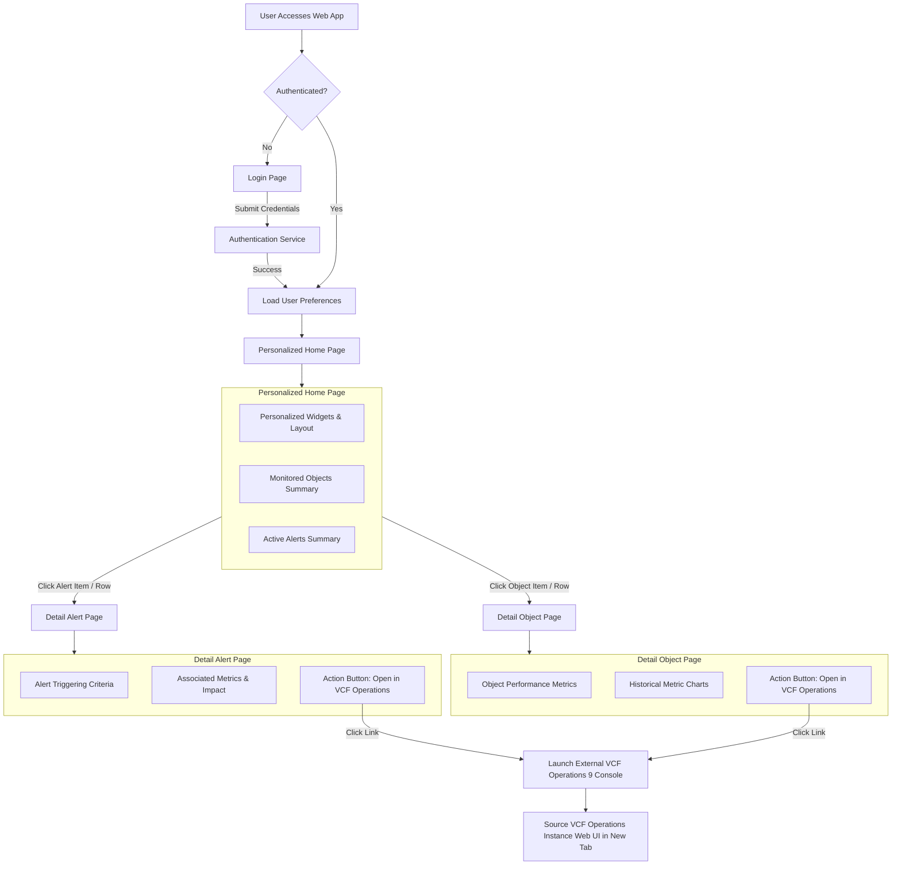
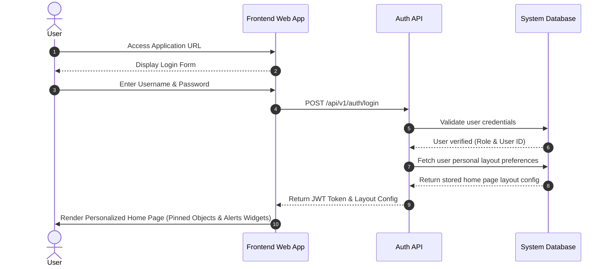
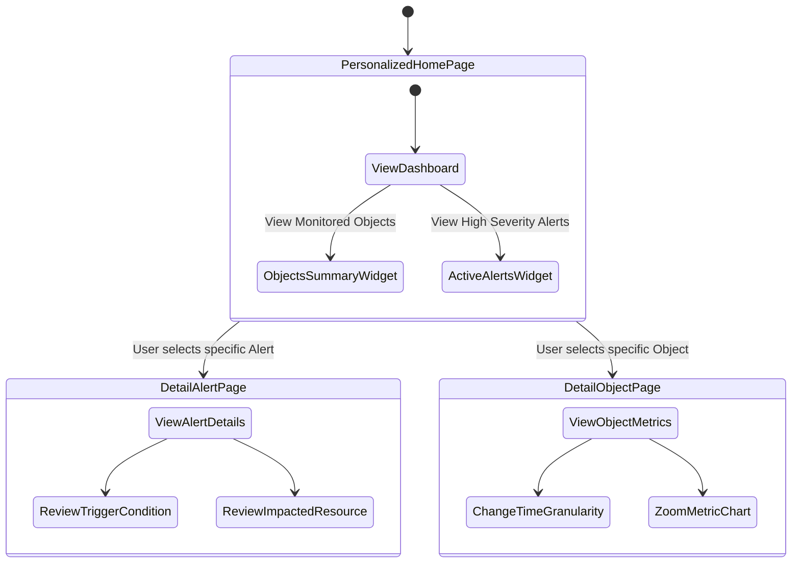
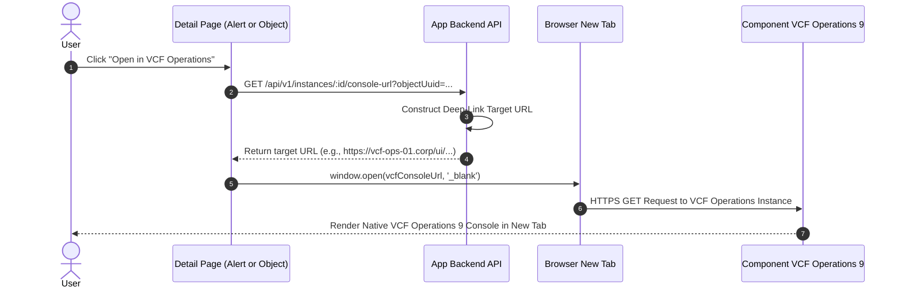

# Requirements Document

This document defines the functional and technical requirements for the Federated VMware Cloud Foundation (VCF) Operations 9 Web Application.

---

# Part 1: Functional Requirements

## 1. Functional Features

### 1.1 Multi-Instance VCF Operations 9 Connectivity
* **REQ-FUN-001**: The system MUST connect to multiple VCF Operations 9 instances concurrently.
* **REQ-FUN-002**: The system MUST support individual configuration settings for each VCF instance.
* **REQ-FUN-003**: The system MUST support two authentication methods for connecting to VCF Operations 9.x instances:
  * **Option A — Local Credentials (`OpsToken`)**: Uses username, password, and auth source (`LOCAL` / `LDAP`) via `POST /suite-api/api/auth/token/acquire`, returning `Authorization: OpsToken <token>`. (Default for local or VCF 9.0 instances).
  * **Option B — VCF SSO / VIDB API Refresh Token (`Bearer Token`)**: Best practice for VCF 9.1+. Exchanges a durable API refresh token via VCF Identity Broker (`POST https://{vidb-fqdn}/acs/t/{client-name}/token`), returning `Authorization: Bearer <access_token>`.
* **REQ-FUN-004**: The system MUST monitor token expiration for both authentication methods and automatically acquire a fresh token before expiration.
* **REQ-FUN-005**: If a VCF instance is unreachable, the system MUST log the error. It MUST continue collecting data from all other reachable instances.

### 1.2 Automated Ingestion Engine & 1-Minute Polling Loop
* **REQ-FUN-006**: The system MUST run an ingestion cycle every 60 seconds (1 minute).
* **REQ-FUN-007**: The ingestion engine MUST query object metadata from `/suite-api/api/resources`.
* **REQ-FUN-008**: The ingestion engine MUST query numerical performance stats from `/suite-api/api/resources/stats`.
* **REQ-FUN-009**: The ingestion engine MUST query active and historical alerts from `/suite-api/api/alerts`.
* **REQ-FUN-010**: Data collection across multiple instances MUST execute in parallel workers.

### 1.3 Fast & Light Duplicate Data Detection
* **REQ-FUN-011**: The system MUST NOT insert duplicate metric samples or duplicate alert records into the database.
* **REQ-FUN-012**: Duplicate checks MUST run fast. They MUST consume minimal CPU and memory resources.
* **REQ-FUN-013**: The system MUST maintain a watermark table. The table stores the `last_polled_timestamp` for each instance and data type.
* **REQ-FUN-014**: The system MUST request metric deltas from VCF Operations using `begin={last_polled_timestamp + 1}`.
* **REQ-FUN-015**: The system MUST request alert updates using the alert modification timestamp (`updateTimeUTC`).
* **REQ-FUN-016**: The database MUST enforce unique constraints (`instance_id + resource_uuid + stat_key + timestamp`). Duplicate inserts MUST be silently ignored at the database layer.

### 1.4 Data Storage & Summary Metrics Computation
* **REQ-FUN-017**: The database footprint MUST remain small and lightweight.
* **REQ-FUN-018**: The system MUST store raw 1-minute metrics in a high-resolution buffer table.
* **REQ-FUN-019**: The system MUST bind every alert, raw metric sample, and summary metric record directly to a target resource (e.g., Virtual Machine `VM-007`, ESXi Host, Datastore) via relational foreign keys.
* **REQ-FUN-020**: The system MUST compute 5-minute metric summary rollups (`min`, `max`, `avg`, `p95`, `sample_count`) for each resource.
* **REQ-FUN-021**: The system MUST compute 1-hour metric summary rollups (`min`, `max`, `avg`, `p95`, `sample_count`) for each resource.
* **REQ-FUN-022**: The system MUST automatically delete raw 1-minute metrics older than the configured retention window (default: 48 hours).
* **REQ-FUN-023**: The system MUST retain 5-minute and 1-hour summary rollups for long-term trend analysis (default: 90 days).

### 1.5 External Metric & Alert Collection Configuration
* **REQ-FUN-024**: The system MUST read metric collection rules from `Configuration/metrics_list.yaml`.
* **REQ-FUN-025**: The system MUST read alert collection rules from `Configuration/alerts_list.yaml`.
* **REQ-FUN-026**: Collection rules MUST be grouped by object type (`VirtualMachine`, `HostSystem`, `ClusterComputeResource`, `Datastore`).
* **REQ-FUN-027**: The system MUST allow Administrators to view, edit, add, remove, and toggle metric and alert collection rules directly from the web application UI on the **System & VCF Configuration Page (`/settings`)**.
* **REQ-FUN-027a**: Upon saving telemetry collection modifications in the UI, the system MUST persist changes to `Configuration/metrics_list.yaml` and `Configuration/alerts_list.yaml` on disk and dynamically reload ingestion rules in memory without requiring an application or server restart.

---

## 2. User Interface Capabilities

### 2.1 Global UI Capabilities
* **REQ-UI-001**: The UI MUST provide a secure login screen for user authentication.
* **REQ-UI-002**: The UI MUST provide a global navigation bar to switch between Home, Alerts Analysis, Metrics Analysis, and System Settings.
* **REQ-UI-003**: The UI MUST feature a global target selector. Users can select all VCF instances or specific instances.
* **REQ-UI-004**: The UI MUST feature a global time range picker (Last 1 Hour, 6 Hours, 24 Hours, 7 Days, Custom Range).
* **REQ-UI-005**: The UI MUST display real-time system status indicators showing ingestion engine online status, connected VCF instances count, and last 1-minute delta poll timestamp, located specifically on the **System & VCF Configuration Page (`/settings`)**.

### 2.2 Personalized Home Page
* **REQ-UI-006**: The system MUST present each authenticated user with a personalized Home Page.
* **REQ-UI-007**: Users MUST be able to personalize their Home Page layout (add, remove, resize, and reorder dashboard widgets).
* **REQ-UI-008**: The Home Page MUST display a summary of key infrastructure Objects (e.g., pinned Virtual Machines, Hosts, Clusters) and their current status.
* **REQ-UI-009**: The Home Page MUST display an Active Alerts summary grouped by severity and impact.
* **REQ-UI-010**: The user's custom layout preferences MUST be saved per user account and restored automatically upon login.

### 2.3 Alerts Analysis & Drill-Down Pages
* **REQ-UI-011**: The system MUST provide a rich and interactive Alerts Analysis page.
* **REQ-UI-012**: Users MUST be able to filter alerts by:
  * VCF Instance name
  * Alert Severity (`CRITICAL`, `IMMEDIATE`, `WARNING`, `INFO`)
  * Alert Status (`ACTIVE`, `CANCELED`, `SUSPENDED`)
  * Target Resource Name (e.g., search for `VM-007`)
  * Resource Kind (Host System, Virtual Machine, Cluster, Datastore, Adapter)
  * Time Window
* **REQ-UI-013**: The page MUST render interactive visual charts (Alert Volume Timeline, Severity Distribution Donut, Top 10 Alerting Objects).
* **REQ-UI-014**: Clicking an alert from the Home Page or Alerts Analysis table MUST navigate the user to a Detail Alert Page.
* **REQ-UI-015**: The Detail Alert Page MUST display full alert definitions, triggering thresholds, impact metrics, and associated resource context.
* **REQ-UI-016**: The Detail Alert Page MUST feature a direct launch button: **"Open in VCF Operations"**.
* **REQ-UI-017**: Clicking **"Open in VCF Operations"** MUST open the exact alert context in the source VCF Operations 9 instance web console in a new browser tab.

### 2.4 Metrics Analysis & Object Drill-Down Pages
* **REQ-UI-018**: The system MUST provide a rich and interactive Metrics Analysis dashboard.
* **REQ-UI-019**: Clicking an Object from the Home Page or Resource Tree MUST navigate the user to a Detail Object Page.
* **REQ-UI-020**: The Detail Object Page MUST feature a resource selection tree and dynamic metric charts (CPU Usage %, Memory Usage %, Disk Latency).
* **REQ-UI-021**: The chart MUST support dynamic resolution switching (Raw 1-Min, 5-Min Rollup, 1-Hour Rollup) and synchronized drag-to-zoom.
* **REQ-UI-021a**: The chart MUST feature **Dual Y-Axes** with unit auto-scaling (e.g. Left Y-axis in blue `#3b82f6` for percentage `%` from `0%` to `100%`, Right Y-axis in amber `#f59e0b` for latency/time `ms` from `0ms` to `40ms`).
* **REQ-UI-021b**: The chart MUST feature an **X-Axis Time Scale** with formatted UTC timestamps (`HH:MM UTC`) across the active time window and horizontal reference gridlines (`#334155`).
* **REQ-UI-021c**: The chart MUST feature a **Synchronized Hover Crosshair** with a vertical dashed guideline across all active series, dynamic data point highlights on dual line paths, and a floating tooltip displaying exact UTC timestamp, CPU Usage %, and CPU Ready Time ms.
* **REQ-UI-021d**: The chart MUST feature a **Drag-to-Zoom Window** with a translucent selection rectangle across the plot area, instant zoom re-rendering, statistical card recalculation (`Minimum`, `Maximum`, `Mean Average`, `95th Percentile`), and a top-right `↺ Reset Zoom` button.
* **REQ-UI-022**: The Detail Object Page MUST feature a direct launch button: **"Open Object in VCF Operations"**.
* **REQ-UI-023**: Clicking **"Open Object in VCF Operations"** MUST open the exact object context in the source VCF Operations 9 instance web console in a new browser tab.

### 2.5 System Configuration Page Telemetry Management
* **REQ-UI-024**: The **System & VCF Configuration Page (`/settings`)** MUST feature an interactive **Telemetry Collection Configuration Editor** enabling Administrators to manage collected metric keys (`metrics_list.yaml`) and alert rules (`alerts_list.yaml`) per object type (`VirtualMachine`, `HostSystem`, `ClusterComputeResource`, `Datastore`).
* **REQ-UI-025**: The Telemetry Collection Configuration Editor MUST support editing via structured form controls (toggle active state, add new metric key, remove metric key, edit unit/description) as well as direct YAML text editing.
* **REQ-UI-026**: The system MUST provide a **"Save & Apply Dynamic Telemetry Rules"** action button that saves configuration changes to disk via REST API endpoints (`PUT /api/v1/system/config/metrics` and `PUT /api/v1/system/config/alerts`) and immediately reloads active polling rules without restarting the application or backend server.

---

## 3. User Flow Diagrams

The following diagrams visualize the user interaction paths using Mermaid syntax.

### 3.1 End-to-End User Flow Overview

---

### 3.2 Detailed Step-by-Step Flow Diagrams

#### Flow Step 1 & 2: User Login and Personalized Home Page

#### Flow Step 3 & 4: Home Page Overview and Drill-Down to Detail Pages

#### Flow Step 5: External VCF Operations Navigation

---

## 4. Usability Aspects

* **REQ-USA-001**: **Simple Navigation**: The web application MUST have a simple, clean layout. Users must reach any feature within 2 mouse clicks.
* **REQ-USA-002**: **Responsive Visual Feedback**: All interactive chart actions (slice, dice, filter, zoom) MUST render updates in under 200 milliseconds.
* **REQ-USA-003**: **Zero Configuration Dashboard Defaults**: Opening the web app MUST instantly show active alerts and key cluster metrics without requiring manual queries.
* **REQ-USA-004**: **Workspace Persistence**: The UI MUST remember the user's last selected VCF instances, filters, and dashboard layout across browser sessions.
* **REQ-USA-005**: **Clear Error Messages**: The UI MUST show user-friendly notifications when network errors or invalid input values occur.

---
---

# Part 2: Technical Requirements

## 1. Scalability Requirements
* **REQ-TEC-001**: The system MUST support monitoring at least 20 concurrent VCF Operations 9 instances.
* **REQ-TEC-002**: The system MUST support tracking up to 50,000 distinct infrastructure objects across instances.
* **REQ-TEC-003**: The ingestion engine MUST process up to 500,000 metric data points per 1-minute collection cycle without memory leaks.
* **REQ-TEC-004**: REST API queries for dashboard charts MUST respond in less than 500 milliseconds for time windows up to 7 days.

---

## 2. Security Requirements
* **REQ-TEC-005**: All stored VCF Operations API user passwords and tokens MUST be encrypted at rest using AES-256-GCM encryption.
* **REQ-TEC-006**: API communication between the ingestion engine and VCF Operations 9 instances MUST use secure HTTPS channels.
* **REQ-TEC-007**: The system MUST allow administrators to enable or disable SSL/TLS certificate validation per VCF instance.
* **REQ-TEC-008**: The web application MUST support user authentication (Username/Password or Single Sign-On).
* **REQ-TEC-009**: The web application MUST provide Role-Based Access Control (RBAC):
  * **Viewer**: Can view alerts and metrics dashboards.
  * **Administrator**: Can add VCF instances, edit credentials, adjust retention settings, and trigger manual purges.
* **REQ-TEC-010**: The backend MUST record administrative action audit logs (adding instances, changing settings).

---

## 3. Availability Requirements
* **REQ-TEC-011**: The system background ingestion engine MUST operate continuously 24 hours a day, 7 days a week.
* **REQ-TEC-012**: Instance failure isolation: A network outage or failure on one VCF instance MUST NOT stop data collection on other instances.
* **REQ-TEC-013**: Automatic Reconnection: If a connection to a VCF instance drops, the engine MUST attempt automatic reconnection using exponential backoff retries.
* **REQ-TEC-014**: Data Recovery on Reconnect: When a VCF instance comes back online, the engine MUST automatically collect missed data up to a configurable maximum catch-up window (default: 6 hours).

---

## 4. Configurable Settings Requirements
The system MUST provide an administrative user interface and environment variables to configure:
* **REQ-TEC-015**: **Polling Interval**: Adjustable from 30 seconds to 300 seconds (default: 60 seconds).
* **REQ-TEC-016**: **Raw Data Retention Period**: Adjustable from 12 hours to 7 days (default: 48 hours).
* **REQ-TEC-017**: **Summary Rollup Retention Period**: Adjustable from 30 days to 365 days (default: 90 days).
* **REQ-TEC-018**: **API Network Timeout**: Adjustable request timeout per VCF instance call (default: 15 seconds).
* **REQ-TEC-019**: **Auto-Prune Execution Time**: Daily schedule time for database cleanup cron jobs (default: 00:00 UTC).
* **REQ-TEC-020**: **Log Detail Level**: Configurable backend log levels (`DEBUG`, `INFO`, `WARN`, `ERROR`).
