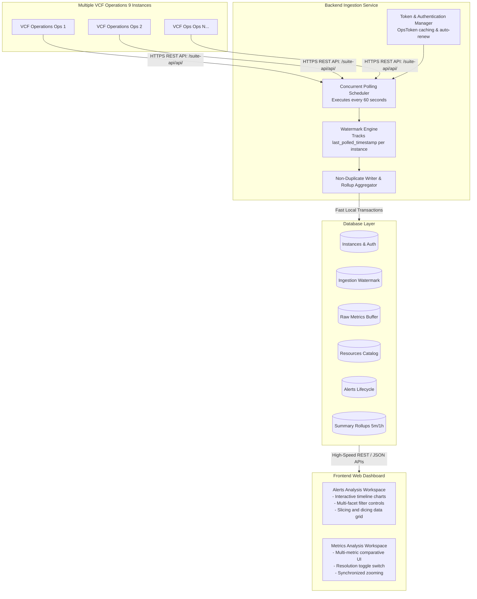
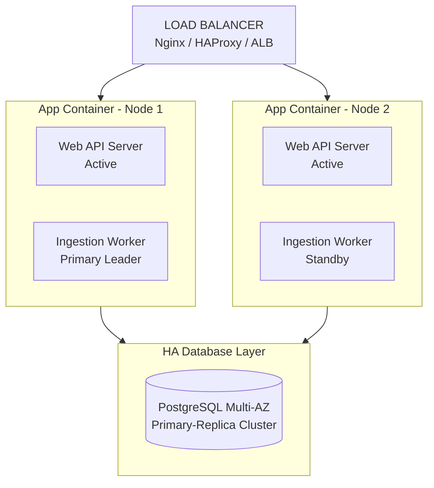
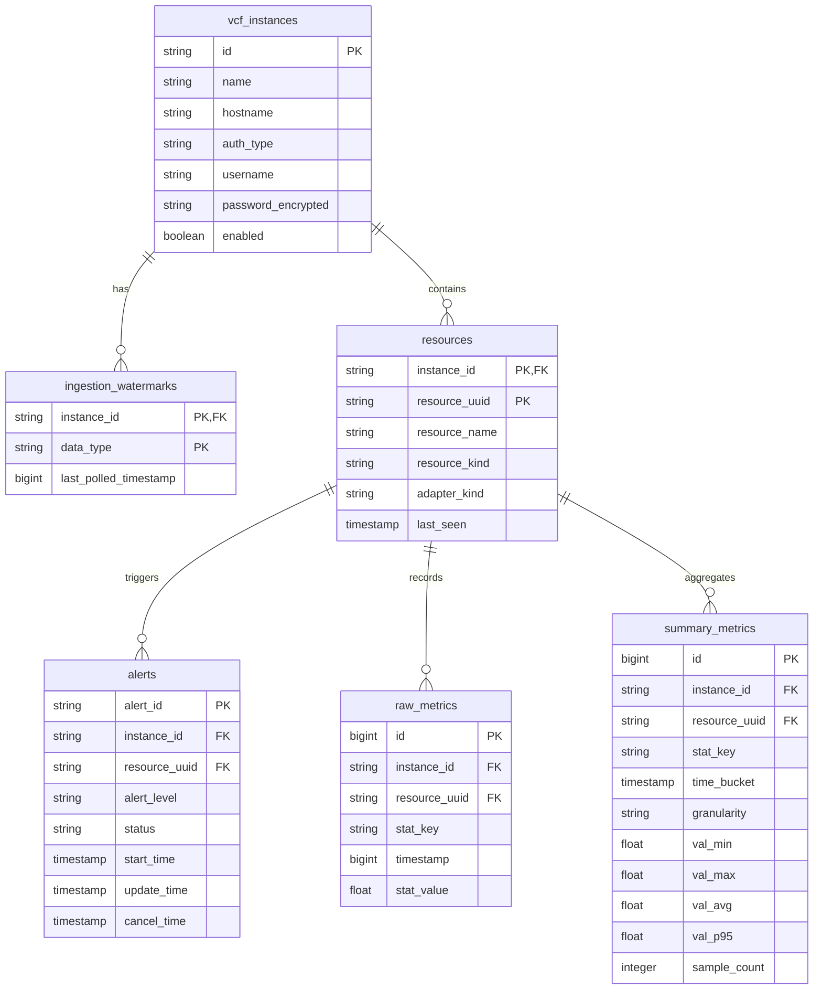

# Technical Solution Architecture Document

This document details the software architecture, design decisions, and operational patterns for the Federated VMware Cloud Foundation (VCF) Operations 9 Web Application.

---

# 1. Overall Architecture

## 1.1 High-Level Architecture Overview
The system is built as a lightweight, high-performance web application.
It uses an asynchronous backend engine, a relational database, and a rich single-page React frontend.



## 1.2 Component Breakdown
1. **Ingestion Engine**:
   * Schedules async jobs every 60 seconds.
   * Manages VCF 9 session tokens (`POST /api/auth/token/acquire`).
   * Fetches resource metadata, delta stats, and alert state updates.
   * Runs in-memory duplicate filtering before writing to the database.

2. **Rollup & Cleanup Worker**:
   * Aggregates raw 1-minute metrics into 5-minute summary buckets (`min`, `max`, `avg`, `p95`).
   * Aggregates 5-minute rollups into 1-hour summary buckets.
   * Runs daily cron jobs to purge raw records older than retention rules (default: 48 hours).

3. **REST API Gateway**:
   * Serves frontend JSON endpoints for metrics, alerts, instances, and status.
   * Handles user authentication and role validation.
   * Aggregates multi-instance queries efficiently.

4. **Interactive Single-Page UI**:
   * Built with React 18, TypeScript, Tailwind CSS, and Apache ECharts.
   * Provides real-time slice-and-dice charting for alerts and performance metrics.

---

# 2. Database Architecture Choice (Classic RDBMS vs Alternatives)

## 2.1 Architectural Decision: Classic RDBMS Selection
**Yes, we are using a Classic Relational Database Management System (Classic RDBMS).**
Specifically, the system supports:
* **SQLite (with Write-Ahead Logging / WAL mode)** for simple, zero-dependency, single-container deployments.
* **PostgreSQL** for multi-node enterprise deployments requiring high-availability clustering.

## 2.2 Trade-off Analysis & Alternatives Comparison

| Database Architecture Option | Pros | Cons | Recommendation Status |
| :--- | :--- | :--- | :--- |
| **Classic RDBMS (SQLite WAL / PostgreSQL)** | - **Zero external services**: SQLite runs inside process; single DB file.<br>- **Strong Relational Joins**: Fast SQL JOIN operations across `resources`, `alerts`, and `summary_metrics`.<br>- **Low Memory & CPU Footprint**: Ideal for small, simple requirements.<br>- **ACID Transactions**: Guarantees data consistency during rollups. | - High-frequency writes require WAL mode or connection pooling.<br>- Row storage requires composite indexing for timeseries range queries. | **SELECTED** |
| **Dedicated Time-Series DB (TSDB: InfluxDB / Prometheus)** | - Native compression for long timeseries sequences.<br>- Automatic partition drop by retention policy. | - **Weak Relational Modeling**: Extremely poor at joining non-metric metadata (e.g., complex alert states, RBAC users, resource hierarchies).<br>- **Complex Deployment**: Requires extra container services and high RAM. | **REJECTED** (Violates requirement for simple database) |
| **NoSQL / Document DB (MongoDB / Elasticsearch)** | - Dynamic schema for variable payload structures. | - High disk and memory usage.<br>- Poor join performance across alerts and resources.<br>- Complex operational setup. | **REJECTED** |

## 2.3 Why Classic RDBMS Fits Best
1. **Relational Integrity**: Alerts and performance metrics belong to specific infrastructure resources. Relational Foreign Key constraints guarantee that deleted or updated objects immediately cascade across alerts and metrics.
2. **Simplified Slicing & Dicing**: SQL `WHERE`, `GROUP BY`, and `JOIN` clauses allow instantaneous filtering by VCF instance, resource kind, alert severity, and metric type.
3. **Small Footprint**: Storing raw data in a short 48-hour buffer and pre-aggregating summary rollups keeps SQLite/PostgreSQL database files very small (under a few gigabytes), avoiding the overhead of heavy time-series engines.

## 2.4 Collection Configuration Format (YAML vs XML / JSON)
The ingestion engine uses external configuration files located in the `Configuration/` folder:
* `Configuration/metrics_list.yaml`
* `Configuration/alerts_list.yaml`

### Format Decision: YAML
**YAML (YAML Ain't Markup Language)** was selected as the configuration format.

| Format | Readability & Maintainability | Syntax Noise | Comments Support | Recommendation |
| :--- | :--- | :--- | :--- | :--- |
| **YAML** | **Very High** (Clean indentation, human-friendly) | **Minimal** (No closing tags or braces) | **Native (`#`)** | **SELECTED** |
| **XML** | **Poor** (Extremely verbose, hard to read) | **Very High** (`<tag></tag>` clutter) | Verbose (`<!-- -->`) | **REJECTED** |
| **JSON** | **Moderate** (Strict quotes, brackets) | **Moderate** (`"key": "value"`, commas) | **None** (JSON standard lacks comments) | **REJECTED** |

### How the Application Uses Configuration Files
1. At startup (and on file modification watcher triggers), the ingestion engine loads both YAML files.
2. When querying metrics via `POST /suite-api/api/resources/stats/query`, the engine filters statKeys against `Configuration/metrics_list.yaml` for the given resource kind (e.g. `VirtualMachine`).
3. When retrieving alerts via `GET /suite-api/api/alerts`, the engine filters alerts against `Configuration/alerts_list.yaml`.

---

# 3. Security Considerations

## 3.1 Encryption at Rest & In Transit
* **Credentials Encryption**: VCF Operations password credentials are encrypted at rest using AES-256-GCM authenticated encryption. The master encryption key is loaded from an environment variable (`ENCRYPTION_KEY`).
* **Transport Layer Security (TLS)**: All communication with VCF Operations instances uses HTTPS. TLS 1.2 and TLS 1.3 protocols are enforced.
* **Certificate Handling**: The administrator can configure per-instance SSL verification options (`rejectUnauthorized: true/false`). This supports internal enterprise CA setups.

## 3.2 Token Handling & Session Security
* **Token Caching**: VCF `OpsToken` and SSO `Bearer` tokens are cached in backend memory. Tokens are never exposed to the frontend browser client.
* **Auto-Renewal**: The token manager inspects token expiration timestamps. It automatically acquires a fresh token 5 minutes before expiration.
* **User Authentication**: Web UI access requires session tokens (JWT or secure HTTP-only cookies).
* **Role-Based Access Control (RBAC)**:
  * `VIEWER`: Read-only access to alerts, metrics, and dashboards.
  * `ADMIN`: Full management access to add VCF instances, update credentials, change retention settings, and view system logs.

## 3.3 Input Validation & API Protection
* **Query Parameter Validation**: All incoming REST API parameters are validated using strict schemas (e.g., Zod).
* **SQL Injection Prevention**: Database queries use parameterized statements exclusively via Prisma / Kysely ORM.
* **Rate Limiting**: API routes are protected by backend rate limiting middleware to prevent UI query spamming.

---

# 4. Performance Considerations

## 4.1 Fast Ingestion & Watermarking Algorithm
To collect data from multiple VCF instances every 1 minute without overloading CPU, memory, or network bandwidth:
1. **High-Watermark Tracking**:
   * The ingestion worker reads `last_polled_timestamp` for the target instance from table `ingestion_watermarks`.
   * It sends a light delta request to VCF Operations API:
     `POST /suite-api/api/resources/stats/query`
     Payload specifies `begin = last_polled_timestamp + 1` and `currentOnly = true`.
2. **Delta Alert Fetching**:
   * Alerts are fetched using `GET /suite-api/api/alerts`.
   * Only alerts modified after the last recorded `updateTimeUTC` are retrieved.
3. **Database Composite Indexing**:
   * Raw metrics table uses a composite unique index:
     `UNIQUE(instance_id, resource_uuid, stat_key, timestamp)`.
   * Insert operations use `INSERT OR IGNORE` (SQLite) or `ON CONFLICT DO NOTHING` (PostgreSQL).
   * Duplicate records are rejected instantly in $O(1)$ time complexity.

## 4.2 Database Performance Optimization
* **SQLite WAL Mode**: When using SQLite, Write-Ahead Logging (WAL) is enabled (`PRAGMA journal_mode=WAL`). WAL mode allows concurrent read queries from web users while background ingestion writes data continuously.
* **Connection Pooling**: PostgreSQL deployments utilize connection pooling to keep database latency under 10 milliseconds.
* **Summary Rollup Bucketing**: Chart queries covering long date ranges (e.g., 7 days) automatically fetch pre-aggregated 5-minute or 1-hour summary rollups instead of millions of raw 1-minute samples.

## 4.3 Frontend Charting & UI Performance
* **Apache ECharts Canvas Engine**: ECharts renders timeseries charts using HTML5 Canvas. It easily renders 50,000+ data points with smooth 60 FPS zoom and pan capabilities.
* **Data Virtualization**: UI tables (TanStack Table) render only visible rows in the viewport. This keeps DOM node count low and prevents browser memory lag.

---

# 5. Availability & High Availability (HA) Design

## 5.1 Fault Isolation & Resiliency
* **Independent Instance Processing**: Each VCF Operations instance runs inside an isolated async worker context. If Instance A times out or suffers an outage, Instance B and Instance C continue collecting data without delay.
* **Retry Mechanism with Exponential Backoff**:
  * API request failures trigger automatic retries.
  * Initial delay: 2 seconds. Subsequent retries double the delay up to a max of 30 seconds.
  * Maximum retries per 1-minute cycle: 3 attempts.

## 5.2 High Availability (HA) Deployment Options



1. **Single-Node Deployment (Standard)**:
   * Run application as a single container managed by Docker Compose or systemd.
   * Automatic container restart (`restart: unless-stopped`) recovers from process crashes within 5 seconds.

2. **Multi-Node Deployment (High Availability Enterprise)**:
   * **Active-Passive Leader Election**: Distributed lock mechanism (e.g., Redis or DB row lock) ensures only one backend container acts as the active Ingestion Leader.
   * **Stateless API Web Servers**: Multiple container instances sit behind an HTTP load balancer (Nginx / ALB) to serve web UI requests.
   * **PostgreSQL High Availability**: Managed PostgreSQL cluster (Primary + Standby replica) ensures zero data loss.

## 5.3 Health Check Monitoring
* Endpoints provided:
  * `/healthz`: Returns HTTP 200 OK if service is healthy.
  * `/api/v1/system/status`: Returns detailed health, active polling workers, database size, and per-instance collection status.

---

# 6. Maintainability & Operations

## 6.1 Automated Backup & Restore Procedures
1. **SQLite Database Backup**:
   * Uses online backup API (`PRAGMA vacuum_into = 'backup.db'`).
   * Can be backed up while the system is running without locking database reads or writes.
2. **PostgreSQL Database Backup**:
   * Daily automated `pg_dump` snapshot jobs.
3. **Restoration**:
   * Restoring requires placing the backup database file into the storage volume and launching the container. Schema auto-migrations run automatically on container startup.

## 6.2 Software Upgrades & Database Migrations
* **Zero Downtime Database Migrations**: Schema updates are managed via Prisma Migration scripts.
* **Backwards-Compatible Schema Changes**: Column additions use default values to ensure existing database files upgrade seamlessly.
* **Docker Image Updates**: Upgrades are executed via container replacement (`docker compose pull && docker compose up -d`).

## 6.3 Automated Data Pruning
* A background cron process runs every day at 00:00 UTC.
* **Purge Execution**:
  * Deletes raw metrics where `timestamp < NOW() - retention_raw_hours`.
  * Deletes summary rollups where `time_bucket < NOW() - retention_summary_days`.
  * Executes `VACUUM` command periodically to reclaim unused disk space.

## 6.4 Logging & Diagnostics
* Structured JSON logging via Winston / Pino.
* Logs include timestamp, log level, instance ID, component name, execution duration, and error details.
* Log output directed to `stdout` for container log collectors (Fluentd, Datadog, ELK).

---

# 7. Relational Database Schema Design

## 7.1 Entity Relationship Diagram (ERD)



## 7.2 Explicit Foreign Key Relationships & Descriptions

### 1. `resources` Table (Core Infrastructure Object Catalog)
* **Primary Key**: Composite `(instance_id, resource_uuid)`.
* **Description**: Every discovered virtual machine (e.g., `VM-007`), ESXi host, datastore, or cluster is registered here.

### 2. `alerts` Table (Alerts Bound to Objects)
* **Primary Key**: `alert_id`.
* **Foreign Key**: `FOREIGN KEY (instance_id, resource_uuid) REFERENCES resources(instance_id, resource_uuid) ON DELETE CASCADE`.
* **Why this relationship exists**:
  * An alert is **strictly tied to a specific resource object**. For example, a high CPU usage alert is triggered directly on `VM-007` within VCF Instance A.
  * Linking `alerts` to `resources` via Foreign Key allows the UI to slice and dice alerts by **Resource Kind** (VM, Host, Datastore), **Adapter Type**, or **Object Name**.

### 3. `summary_metrics` Table (Pre-Aggregated Metric Rollups)
* **Primary Key**: Auto-incrementing `id`.
* **Foreign Key**: `FOREIGN KEY (instance_id, resource_uuid) REFERENCES resources(instance_id, resource_uuid) ON DELETE CASCADE`.
* **Why this relationship exists**:
  * Pre-computed rollups (`min`, `max`, `avg`, `p95`, `sample_count`) belong to a specific object (e.g., `VM-007`) for a given metric key (`cpu|usagemhz`).
  * Linking `summary_metrics` to `resources` via Foreign Key allows instant dynamic dashboard slicing (e.g., "Show me 5-minute CPU rollups for all VMs belonging to Cluster-01").

### 4. `raw_metrics` Table (High-Resolution 1-Minute Buffer)
* **Primary Key**: Auto-incrementing `id`.
* **Foreign Key**: `FOREIGN KEY (instance_id, resource_uuid) REFERENCES resources(instance_id, resource_uuid) ON DELETE CASCADE`.
* **Why this relationship exists**:
  * Raw 1-minute metrics are linked directly to `resources` for high-resolution 48-hour troubleshooting charts.

---

# 8. REST API & UI Component Specifications

## 8.1 Key REST API Endpoints

| HTTP Method | API Path | Parameters | Description |
| :--- | :--- | :--- | :--- |
| `GET` | `/api/v1/instances` | None | List configured VCF Operation instances |
| `POST` | `/api/v1/instances` | JSON Body | Register a new VCF instance |
| `PUT` | `/api/v1/instances/:id` | JSON Body | Update instance config / credentials |
| `DELETE` | `/api/v1/instances/:id` | None | Remove a VCF instance |
| `GET` | `/api/v1/alerts` | `instanceId, resourceUuid, severity, status, search, page, limit` | Search and slice/dice alerts linked to resources |
| `GET` | `/api/v1/alerts/stats` | `instanceId, timeRange` | Get aggregated alert counts for timeline & donut charts |
| `GET` | `/api/v1/metrics/query` | `instanceId, resourceUuid, statKeys, resolution, from, to` | Fetch metric timeseries data for charts |
| `GET` | `/api/v1/resources` | `instanceId, kind, search` | Query object hierarchy for resource tree selector |
| `GET` | `/api/v1/system/status` | None | Get health status, DB size, and ingestion worker stats |

## 8.2 UI Workspaces
1. **Alerts Analysis Workspace**:
   * Filter Toolbar: Faceted multiselect for instances, severities, alert state, and resource kinds.
   * Visual Charts: Apache ECharts interactive timeline and severity donut chart.
   * Data Table: Dynamic TanStack Table with virtualized scrolling, search, sorting, resource name links, and CSV export.
2. **Metrics Analysis Workspace**:
   * Resource Tree: Collapsible sidebar tree selector with search filter.
   * Metric Selector: Checkbox panel for standard metrics (CPU, Memory, Storage, Network).
   * Charting Canvas: Synchronized multi-metric chart renderer with mouse drag zoom and resolution selector (1-min raw, 5-min summary, 1-hr summary).

---

# 9. Deployment & Containerization Strategy

## 9.1 Docker Compose Deployment Setup
The application is packaged as a standard Docker container set.

```yaml
version: '3.8'

services:
  vcf-ops-app:
    image: vcf-federated-ops:latest
    container_name: vcf_federated_ops
    restart: unless-stopped
    ports:
      - "3000:3000"
    environment:
      - NODE_ENV=production
      - DATABASE_URL=file:/app/data/vcf_ops.db
      - ENCRYPTION_KEY=your_secret_32_byte_key_here
      - POLLING_INTERVAL_SECONDS=60
      - RETENTION_RAW_HOURS=48
      - RETENTION_SUMMARY_DAYS=90
    volumes:
      - vcf_data:/app/data

volumes:
  vcf_data:
```

## 9.2 Deployment Execution Steps
1. Clone the repository.
2. Configure `.env` file with encryption keys and target VCF instances.
3. Run `docker compose up -d`.
4. Access web application interface at `http://<server-ip>:3000`.
