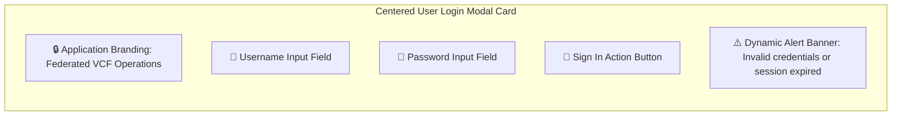

# Page 1: User Login Page

* **Route**: `/login`
* **Target Audience**: All users accessing the portal.
* **Primary Goal**: Securely authenticate users, generate session tokens, and load personal layout preferences.

---

## 📐 Graphical Visual Layout & Wireframe

### Component & Region Layout Breakdown

| Element | Component Type | Interaction & Validation |
| :--- | :--- | :--- |
| **Branding Header** | Logo & Title | Renders application logo and product title text. |
| **Username Field** | Text Input | Auto-focused on page mount; supports keyboard submission on Enter. |
| **Password Field** | Password Input | Masked input field with toggle visibility action. |
| **Sign In Button** | Primary Action Button | Triggers `POST /api/v1/auth/login` request; shows loading spinner while processing. |
| **Alert Banner** | Context Banner | Displays dynamic error messages on authentication failure (HTTP 401/403) or session timeout. |

---

## ⚡ Key Functions & Controls

1. **Credentials Form**: Input fields for Username and Password with auto-focus on load.
2. **Sign In Action Button**: Triggers `POST /api/v1/auth/login` payload validation.
3. **Session Persistence**: Sets secure HTTP-only cookie or JWT session bearer token upon successful authentication.
4. **Automatic Redirect**: Redirects authenticated users directly to `/` (Personalized Home Page).
5. **Inline Error Messaging**: Displays dynamic error banners for expired sessions or invalid credentials.

---

## 🔌 API Endpoints & State Machine

* `POST /api/v1/auth/login`: Submits login payload (`{ username, password }`).
* `GET /api/v1/auth/me`: Validates existing session tokens on initial app load.
