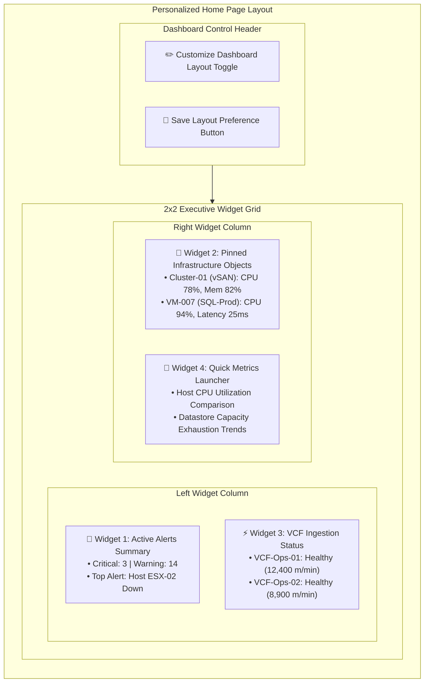

# Page 2: Personalized Home Page

* **Route**: `/`
* **Target Audience**: Infrastructure Operators and Cloud Administrators.
* **Primary Goal**: Provide a customizable, executive-level overview of monitored VCF instances, pinned infrastructure objects, and active alerts summary.

---

## 📐 Graphical Visual Layout & Wireframe

### Component & Widget Layout Breakdown

| Widget / Region | Grid Position | Features & Interactions |
| :--- | :--- | :--- |
| **Dashboard Controls** | Top Toolbar | Toggle edit mode to drag, resize, add, or delete widgets. "Save Preference" persists grid layout. |
| **Active Alerts Summary** | Grid Slot (Top-Left) | Interactive donut & severity counters. Clicking a severity count redirects to `/alerts` with pre-applied filters. |
| **Pinned Objects** | Grid Slot (Top-Right) | Displays quick status metrics for user-bookmarked VMs, Hosts, or Clusters. Opens `/objects/:uuid`. |
| **Ingestion Health Status** | Grid Slot (Bottom-Left) | Live telemetry rate (metrics/min) and polling status for each registered VCF Operations 9 instance. |
| **Quick Metrics Launcher** | Grid Slot (Bottom-Right) | One-click access to pre-configured comparative metric dashboard views. |

---

## ⚡ Key Functions & Controls

1. **Customization Mode Toggle**: Allows users to drag, resize, add, or remove dashboard widgets.
2. **Save Preferences Button**: Persists custom widget layouts to backend database (`PUT /api/v1/users/preferences`).
3. **Active Alerts Summary Widget**: Displays interactive alert counts grouped by severity; clicking a severity count redirects to `/alerts` with pre-applied filters.
4. **Pinned Objects Widget**: Displays real-time status metrics for user-bookmarked VMs, Hosts, or Clusters.
5. **Click-Through Navigation**: Clicking any object or alert card immediately opens its respective detail page (`/objects/:uuid` or `/alerts/:id`).

---

## 🔌 API Endpoints & State Machine

* `GET /api/v1/users/preferences`: Fetches saved widget layout preferences for logged-in user.
* `PUT /api/v1/users/preferences`: Saves updated widget grid placement.
* `GET /api/v1/alerts/summary`: Retrieves total counts of active alerts grouped by severity level.
* `GET /api/v1/objects/pinned`: Retrieves live status and key metrics for pinned resource UUIDs.
