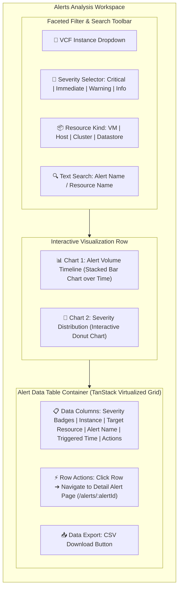

# Page 3: Alerts Analysis Page

* **Route**: `/alerts`
* **Target Audience**: System Administrators and Incident Response Teams.
* **Primary Goal**: Provide multi-dimensional slicing and dicing of alerts across all connected VCF Operations instances.

---

## 📐 Graphical Visual Layout & Wireframe

### Component & Region Layout Breakdown

| Component | Panel Position | Function & User Interactions |
| :--- | :--- | :--- |
| **Filter Toolbar** | Top Sticky Bar | Multi-select dropdowns for Instance, Severity, Status, Kind, and instant text search. Syncs with URL parameters. |
| **Alert Timeline Chart** | Top-Left Panel (60% W) | Stacked bar chart showing alert frequencies over time. Dragging a selection box zooms into a specific time window. |
| **Severity Donut** | Top-Right Panel (40% W) | Donut chart displaying severity proportions. Clicking a slice filters the table below by severity. |
| **Alert Data Grid** | Bottom Full-Width Container | High-performance virtualized table. Clicking any row opens `/alerts/:alertId`. Includes CSV export button. |

---

## ⚡ Key Functions & Controls

1. **Faceted Filter Toolbar**: Dropdowns for VCF Instance, Alert Severity (`CRITICAL`, `IMMEDIATE`, `WARNING`, `INFO`), Alert Status (`ACTIVE`, `CANCELED`), and Resource Kind.
2. **Instant Text Search Bar**: Real-time client-side filter searching table rows by alert name or target resource name.
3. **Interactive Timeline Chart**: Stacked bar chart rendering alert counts over time. Dragging a selection box zooms into that time window across the grid.
4. **Interactive Severity Donut**: Clicking a donut segment (e.g., `CRITICAL`) instantly filters the table below.
5. **Alert Data Grid**: Sortable columns, virtualized infinite scrolling, and CSV export action button.
6. **Row Click Action**: Opens Page 4 (`/alerts/:alertId`).

---

## 🔌 API Endpoints & State Machine

* `GET /api/v1/alerts`: Retrieves paginated alert list with query filters (`instance_id`, `severity`, `status`, `kind`, `search`, `begin`, `end`).
* `GET /api/v1/alerts/timeline`: Fetches aggregated alert counts bucketed by time interval.
