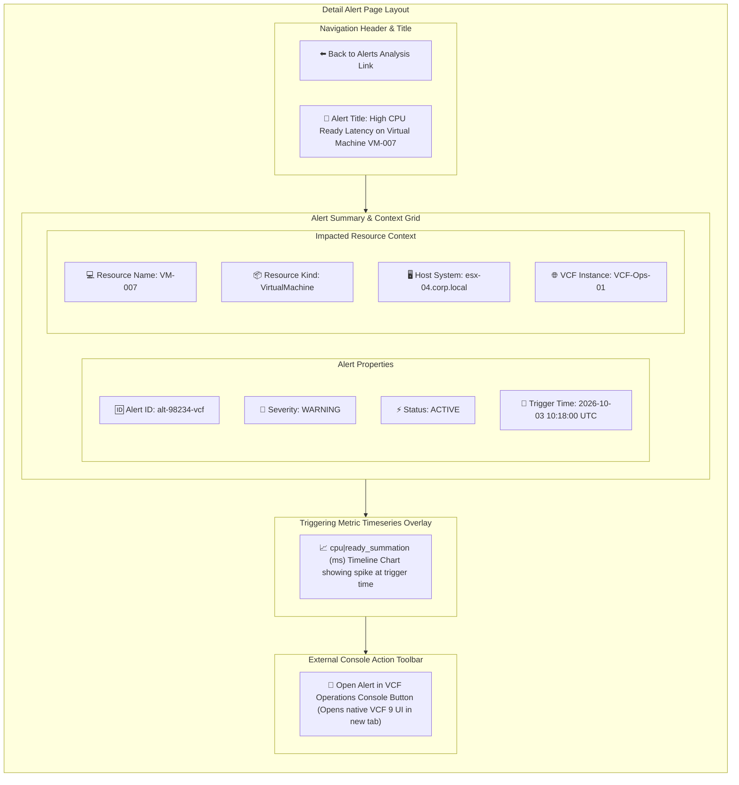

# Page 4: Detail Alert Page

* **Route**: `/alerts/:alertId`
* **Target Audience**: Engineers troubleshooting a specific alert.
* **Primary Goal**: Display triggering conditions, impact scope, associated metrics, and provide direct deep-linking into the native source VCF Operations web console.

---

## 📐 Graphical Visual Layout & Wireframe

### Component & Region Layout Breakdown

| Panel | Grid Position | Features & User Interactions |
| :--- | :--- | :--- |
| **Navigation & Header** | Top Bar | Breadcrumb link back to `/alerts` and alert summary banner. |
| **Properties Panel** | Top-Left Grid | Shows alert UUID, severity status token, trigger timestamp, and recommendation text. |
| **Context Panel** | Top-Right Grid | Contextual details of impacted object, parent host, cluster, and source VCF instance. |
| **Metric Overlay** | Middle Section | Timeseries chart displaying metric values 30 minutes before and after the alert trigger timestamp. |
| **Action Toolbar** | Bottom Bar | Deep-link button constructing direct URL to source VCF Operations 9 UI (`window.open`). |

---

## ⚡ Key Functions & Controls

1. **Alert Overview Panel**: Displays alert definition, triggering thresholds, impact score, and current status.
2. **Impacted Resource Context**: Shows resource metadata, host system, and source VCF instance.
3. **Triggering Metric Timeline Chart**: Embedded chart rendering the exact metric key that triggered the alert.
4. **External Launch Button (`Open in VCF Operations`)**:
   * Constructs deep-link URL to source VCF Operations 9 environment.
   * Executes `window.open("https://{vcf-hostname}/ui/index.action#...", "_blank", "noopener,noreferrer")`.

---

## 🔌 API Endpoints & State Machine

* `GET /api/v1/alerts/:alertId`: Fetches full alert object payload.
* `GET /api/v1/metrics/timeseries`: Queries metrics database for triggering resource UUID and stat key around trigger timestamp window.
