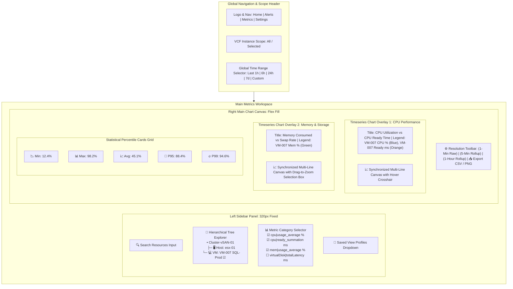

# Page 5: Metrics Analysis Dashboard

* **Route**: `/metrics`
* **Target Audience**: Performance Engineers, Infrastructure Architects, and Capacity Planners.
* **Primary Goal**: Perform multi-instance metric exploration, multi-resource comparative overlays, statistical percentile analysis (`P95`/`P99`), and dynamic resolution toggling (`1-Min Raw`, `5-Min Rollup`, `1-Hour Rollup`).

---

## 📐 Graphical Visual Layout & Component Architecture

ASCII box art was replaced with native **Mermaid diagrams** and **Structured Component Schemas**. Mermaid renders natively into vector graphics inside GitHub, VS Code, and browser markdown previewers, presenting clear layout boundaries, panel ratios, and visual flow.

### Native Visual Wireframe Diagram

---

### Page Region & Layout Breakdown

| Region | Component | Width / Height | Responsibilities & Visual Behavior |
| :--- | :--- | :--- | :--- |
| **Top Header** | Global Application Bar | 100% W × 56px H | Holds global navigation tabs, active VCF instance scope selector, time window selector, and ingestion health banner. |
| **Left Sidebar** | Resource & Metric Selector | 320px W (Collapsible) | Sticky sidebar containing the search input, hierarchical object tree, metric key checklist grouped by category (`CPU`, `Memory`, `Disk`, `Network`), and saved view profiles. |
| **Top Canvas Bar** | Resolution & Action Toolbar | Flex 1 W × 48px H | Houses the resolution toggle buttons (`1-Min Raw`, `5-Min Rollup`, `1-Hour Rollup`), real-time sync toggle, chart layout grid switcher (Single vs Dual Stack), and export buttons. |
| **Main Canvas** | Multi-Series Chart Panels | Flex 1 W (Auto Height) | Interactive vector line charts using TanStack/Recharts. Features synchronized X-axes, hover crosshairs, unit auto-scaling, and drag-to-zoom selection overlay. |
| **Bottom Panel** | Statistical Percentile Grid | 100% W × 90px H | Summary cards calculating exact statistical metrics (`Minimum`, `Maximum`, `Mean Average`, `95th Percentile`, `99th Percentile`) for all displayed metrics over the active time range. |

---

## ⚡ Elaborated Key Functions & Controls Specification

### 1. Hierarchical Searchable Resource Tree
* **Object Discovery & Tree Structure**: Renders infrastructure objects in a 3-level tree hierarchy: `VCF Operations Instance` ➔ `Cluster / ESXi Host` ➔ `Virtual Machine / Datastore`.
* **Instant Filter Search**: Live filter input narrowing down tree nodes by resource name or IP address within 50ms.
* **Multi-Object Selection**: Checkbox toggles allow selecting up to 5 resources simultaneously for side-by-side comparative analysis.
* **Visual Identifiers**: Node icons color-code resource health status (Green = Healthy, Yellow = Warning, Red = Critical).

### 2. Metric Category & Stat Key Selector
* **Categorized Selection Checklist**: Metric keys from `Configuration/metrics_list.yaml` are grouped into collapsible accordions (`CPU`, `Memory`, `Virtual Disk`, `Network System`).
* **Unit Awareness & Auto-Scaling**: The UI groups metrics with matching units onto the same Y-axis (e.g., percentages `%` on left Y-axis, latency `ms` or bytes `KB/s` on right Y-axis). Auto-scales unit formatting (`KB` ➔ `MB` ➔ `GB`).
* **Active Metric Color Legend**: Assigns high-contrast color tokens to each selected metric-resource combination with clickable legend toggles to temporarily hide/show series.

### 3. Granularity Resolution Switcher (Data Tiering)
* **`1-Min Raw Buffer`**: Displays unaggregated 1-minute delta metric data points. Ideal for pinpointing exact transient spikes within the last 48 hours.
* **`5-Min Summary Rollup`**: Queries pre-aggregated 5-minute summary metrics (`min`, `max`, `avg`, `p95`). Default view for 1-7 day windows to ensure fast sub-200ms API response times.
* **`1-Hour Summary Rollup`**: Queries long-term 1-hour rollup metrics. Optimized for capacity planning across 30-90 day windows without transferring millions of raw data points.
* **Auto-Granularity Mode**: Automatically switches resolution tier based on the selected time window length (e.g. `< 6 hours` defaults to 1-Min Raw; `> 7 days` defaults to 1-Hour Rollup).

### 4. Synchronized Drag-to-Zoom (Brush & Event Bus)
* **Cross-Chart Synchronized X-Axis**: Interacting with one chart updates all open charts on the page simultaneously.
* **Drag-to-Zoom Selection**: Click and drag a rectangular bounding box across any chart plot area to instantly zoom into that specific timestamp range across all metric panels.
* **Reset Zoom Button**: Floating quick-action button ("Reset Zoom") restores the chart canvas to the globally selected time range.

### 5. Synchronized Hover Crosshair & Multi-Series Tooltip
* **Vertical Crosshair Line**: Hovering over any chart draws a vertical guideline across all open chart canvases at the exact same timestamp.
* **Unified Tooltip Card**: Displays exact values for all active metric series at the hovered timestamp, sorted by value, complete with color legend dots and percentage deltas from the previous timestamp.

### 6. Statistical Percentile & Summary Cards (`P95` / `P99`)
* **Real-time Statistical Engine**: Client-side calculation engine computes summary statistics for selected metric series across the active time window:
  * **Minimum (`Min`)**: Lowest recorded value.
  * **Maximum (`Max`)**: Peak spike value.
  * **Mean Average (`Avg`)**: Time-weighted mean average.
  * **95th Percentile (`P95`)**: Value below which 95% of data points fall (eliminates anomalous short-lived spikes for accurate capacity sizing).
  * **99th Percentile (`P99`)**: High-watermark SLA compliance threshold.

### 7. Saved View Profiles & URL Query State Synchronization
* **URL Parameter Sync**: All dashboard controls (selected resource UUIDs, stat keys, time range, resolution) automatically sync to URL query parameters (`/metrics?resources=vm-007,vm-008&metrics=cpu|usage_average&res=5m&range=24h`). Allows instant URL sharing between team members.
* **Saved Profile Preset Manager**: Save custom metric dashboard configurations (e.g., "SQL Performance View", "Host Storage Bottleneck View") to user profile preferences for 1-click retrieval.

### 8. Export & Snapshot Toolkit
* **CSV Data Export**: Download raw or rollup timeseries data points in CSV format for offline reporting.
* **Chart Image Download**: Export high-resolution PNG snapshots of the active chart canvas for executive presentation decks.

---

## 🔌 API Endpoints & State Machine

* `GET /api/v1/objects/tree`: Retrieves hierarchical object tree grouped by VCF instance and cluster.
* `GET /api/v1/metrics/query`: Main timeseries query endpoint.
  * **Query Parameters**: `resource_uuids` (comma-separated), `stat_keys` (comma-separated), `resolution` (`1m`, `5m`, `1h`), `begin` (epoch ms), `end` (epoch ms).
* `POST /api/v1/users/dashboards`: Saves customized dashboard view profiles.
