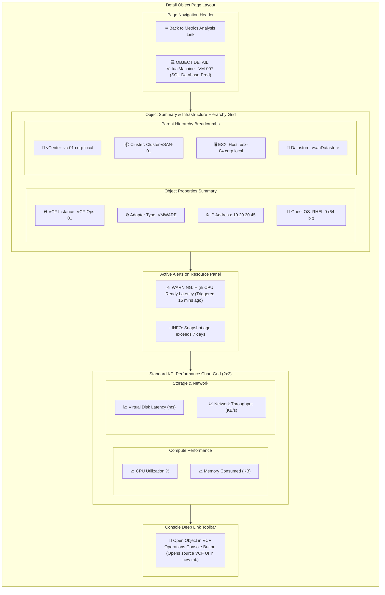

# Page 6: Detail Object Page

* **Route**: `/objects/:resourceUuid`
* **Target Audience**: System Engineers reviewing a single infrastructure asset.
* **Primary Goal**: Deep-dive performance and status analysis for a specific resource (VM, ESXi Host, Cluster, Datastore), showing KPI charts, active alerts, and parent-child hierarchy.

---

## 📐 Graphical Visual Layout & Wireframe

### Component & Region Layout Breakdown

| Section | Grid Position | Features & User Interactions |
| :--- | :--- | :--- |
| **Object Header** | Top Navigation Bar | Route breadcrumb and resource title banner. |
| **Summary & Hierarchy** | Top 2-Column Grid | Metadata properties (IP, OS, Adapter) and clickable parent infrastructure links. |
| **Active Alerts List** | Middle Panel | Live list of triggered alerts for this UUID with severity badges and direct alert links. |
| **KPI Chart Grid** | 2x2 Chart Panel | Standardized KPI timeseries charts (CPU, Memory, Disk Latency, Network) with synchronized tooltips. |
| **Action Toolbar** | Bottom Bar | Direct deep-link launcher to open object in native VCF Operations console (`window.open`). |

---

## ⚡ Key Functions & Controls

1. **Hierarchy Breadcrumbs**: Displays parent vCenter, Cluster, ESXi host, and Datastore links.
2. **Object Alert List**: Inline table displaying active alerts bound to this specific resource UUID.
3. **Standard KPI Performance Grid**: Preset charts for CPU Utilization, Memory Consumed, Disk Latency, and Network Throughput.
4. **External Launch Button (`Open Object in VCF Operations`)**: Opens the exact object dashboard in native VCF Operations 9 web console in a new tab.

---

## 🔌 API Endpoints & State Machine

* `GET /api/v1/objects/:resourceUuid`: Retrieves object properties, metadata, and parent hierarchy links.
* `GET /api/v1/alerts?resource_uuid=:resourceUuid`: Retrieves active alerts bound to this object.
* `GET /api/v1/metrics/kpi?resource_uuid=:resourceUuid`: Fetches standard KPI metric series.
