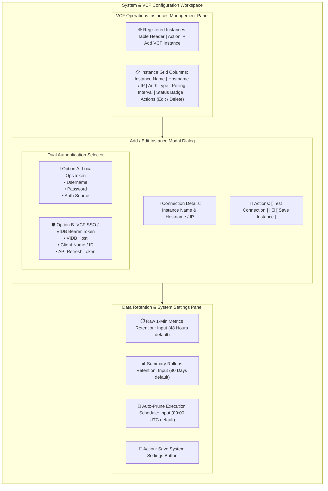

# Page 7: System & VCF Configuration Page

* **Route**: `/settings`
* **Target Audience**: System Administrators.
* **Primary Goal**: Manage VCF Operations 9 instance connections, configure authentication credentials (Local `OpsToken` vs. VCF SSO `Bearer Token`), adjust polling frequency, and configure data retention rules.

---

## 📐 Graphical Visual Layout & Wireframe

### Component & Region Layout Breakdown

| Section | Component | Features & User Interactions |
| :--- | :--- | :--- |
| **Instance Management Table** | Top Panel | Interactive table displaying registered VCF Operations instances, status badges (`Healthy`, `Unreachable`, `Auth Error`), and edit/delete triggers. |
| **Dual Auth Modal** | Modal Dialog | Supports **Option A** (Local `OpsToken` credentials) and **Option B** (VCF SSO `Bearer Token` via Identity Broker). Includes a "Test Connection" button that validates endpoints prior to saving. |
| **Retention Policy Form** | Bottom Panel | Configures raw metric buffer purge thresholds (hours) and long-term rollup retention windows (days). |

---

## ⚡ Key Functions & Controls

1. **Instance Management Table**: Lists all registered VCF Operations instances with real-time health badges (`Healthy`, `Unreachable`, `Auth Error`).
2. **Dual Authentication Configuration Modal**:
   * **Option A (Local OpsToken)**: Input fields for Username, Password, and Auth Source.
   * **Option B (VCF SSO Bearer Token)**: Input fields for VIDB Host, Client ID, and API Refresh Token.
3. **Test Connection Action Button**: Calls `POST /api/v1/instances/test` to validate credentials and REST API reachability before saving.
4. **Retention Policy Form**: Configures retention duration for raw 1-minute metrics (hours) and summary rollup metrics (days).

---

## 🔌 API Endpoints & State Machine

* `GET /api/v1/instances`: Retrieves list of registered VCF Operations instances.
* `POST /api/v1/instances`: Registers a new VCF Operations instance.
* `POST /api/v1/instances/test`: Tests connection and credentials for candidate instance.
* `PUT /api/v1/system/settings`: Updates global system settings and data retention policies.
