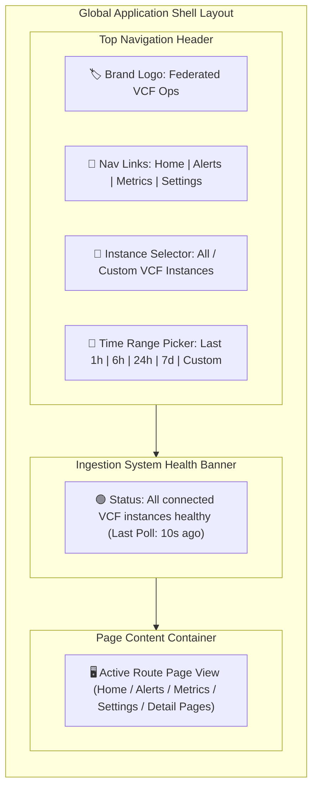

# Web Pages Specifications & Navigation Sitemap

This directory contains the detailed specifications, visual wireframes, user interaction models, and API integration details for all 7 web pages in the Federated VMware Cloud Foundation (VCF) Operations 9 Web Application.

---

## 🗺️ Page Inventory & Navigation Sitemap

```
/ (Root)
│
├── /login                         [Page 1: User Login Page]
│
├── /                              [Page 2: Personalized Home Page]
│
├── /alerts                        [Page 3: Alerts Analysis Page]
│   └── /alerts/:alertId           [Page 4: Detail Alert Page]
│
├── /metrics                       [Page 5: Metrics Analysis Dashboard]
│   └── /objects/:resourceUuid     [Page 6: Detail Object Page]
│
└── /settings                      [Page 7: System & VCF Configuration Page]
```

---

## 🌐 Global Shell & Navigation Header

Every page (except `/login`) is enclosed within the **Global Application Shell**.

### Graphical Global Application Shell Diagram



### Global Header Controls Breakdown

| Control | Type | Function & Behavior |
| :--- | :--- | :--- |
| **Global Navigation Links** | Nav Menu Tabs | Instant route switching (`/`, `/alerts`, `/metrics`, `/settings`). |
| **Global Target Instance Selector** | Multi-Select Dropdown | Filter all page queries across single, multiple, or all connected VCF Operations instances. |
| **Global Time Range Picker** | Presets & Custom Picker | Select time window (`Last 1 Hour`, `6 Hours`, `24 Hours`, `7 Days`, `30 Days`, `Custom Range`). |
| **Real-Time Health Indicator** | Status Badge | Live telemetry badge showing scheduler polling health and timestamp of last ingestion loop. |

---

## 📄 Individual Page Documents

| Page # | Title | Route | File Path |
| :---: | :--- | :--- | :--- |
| **01** | User Login Page | `/login` | [`01_Login_Page.md`](01_Login_Page.md) |
| **02** | Personalized Home Page | `/` | [`02_Home_Page.md`](02_Home_Page.md) |
| **03** | Alerts Analysis Page | `/alerts` | [`03_Alerts_Analysis_Page.md`](03_Alerts_Analysis_Page.md) |
| **04** | Detail Alert Page | `/alerts/:alertId` | [`04_Detail_Alert_Page.md`](04_Detail_Alert_Page.md) |
| **05** | Metrics Analysis Dashboard | `/metrics` | [`05_Metrics_Analysis_Dashboard.md`](05_Metrics_Analysis_Dashboard.md) |
| **06** | Detail Object Page | `/objects/:resourceUuid` | [`06_Detail_Object_Page.md`](06_Detail_Object_Page.md) |
| **07** | System & VCF Configuration Page | `/settings` | [`07_System_Configuration_Page.md`](07_System_Configuration_Page.md) |

---

## 💡 Web Page Documentation Best Practices

1. **Clear Layout Structure & Sitemap**: Every page has a well-defined URL route, target audience, and explicit navigation path.
2. **Standardized Specification Structure**: Each page is defined by Route, Audience, Wireframe Layout, Key Functions & Controls, API Endpoints, and State Machine Rules.
3. **Faceted Filter & URL State Sync**: User input actions (dropdown selections, search strings, time range changes) reflect in query params for easy link sharing.
4. **Design System & Severity Tokens**:
   * `CRITICAL` = `#ef4444` (Red)
   * `IMMEDIATE` = `#f97316` (Orange)
   * `WARNING` = `#f59e0b` (Amber)
   * `INFO` = `#3b82f6` (Blue)
