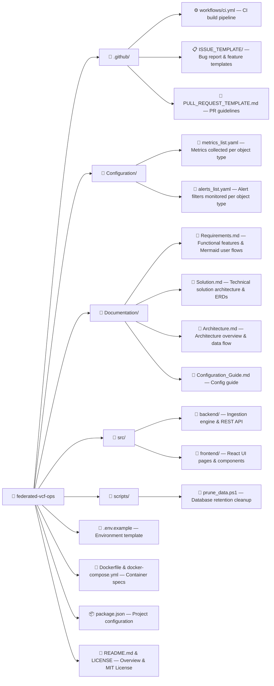

# Federated VMware Cloud Foundation (VCF) Operations 9 Web Application

[](LICENSE)
[](https://developer.broadcom.com/xapis/vcf-operations-api/latest/)
[](.github/workflows/ci.yml)

A centralized, multi-instance monitoring web application for VMware Cloud Foundation (VCF) Operations 9. 

It polls metrics, objects, and alerts every 1 minute from multiple VCF Operations 9 instances, enforces fast non-duplicate ingestion via high-watermarking, computes compact summary metric rollups, and provides rich interactive dashboards for alert triage and metric analysis.

---

## 🌟 Key Features

* **Multi-Instance Aggregation**: Monitor multiple VCF Operations 9 environments concurrently from a single unified portal.
* **Fast & Light Delta Ingestion**: High-watermarking algorithm (`last_polled_timestamp`) queries metric and alert deltas without collecting duplicates.
* **Compact Relational Storage**: High-resolution 1-minute raw metrics buffer auto-purges after 48 hours, while pre-computed 5-minute and 1-hour summary rollups are retained long-term (default 90 days).
* **Personalized Home Page**: Each user can customize their dashboard with pinned objects and active alerts widgets.
* **Alerts Analysis Workspace**: Interactive timeline stacked bar charts, severity donuts, top alerting objects, multi-column search, and deep links to native VCF Operations 9 instances.
* **Metrics Analysis Explorer**: Comparative multi-metric chart overlay, synchronized drag-to-zoom, statistical percentile cards (`P95`/`P99`), and resolution toggles (`1-min`, `5-min`, `1-hour`).
* **YAML-based Collection Config**: Easy-to-read configuration files (`Configuration/metrics_list.yaml` & `alerts_list.yaml`) grouped by object type (`VirtualMachine`, `HostSystem`, `ClusterComputeResource`, `Datastore`).

---

## 📁 Repository Directory Layout



---

## 🚀 Quick Start Guide

### Prerequisites
* **Node.js**: v18.x or v20.x
* **Docker & Docker Compose** (for containerized setup)
* **Access**: Credentials for target VCF Operations 9 instances

### 1. Local Setup
```bash
# Clone the repository
git clone https://github.com/your-org/federated-vcf-ops.git
cd federated-vcf-ops

# Copy environment template
cp .env.example .env

# Install dependencies
npm install

# Run database migrations
npm run db:migrate

# Start development server
npm run dev
```

### 2. Docker Compose Deployment
```bash
# Copy and configure environment variables
cp .env.example .env

# Start application container in background
docker compose up -d

# Verify container status
docker compose ps
```

The web console will be accessible at `http://localhost:3000`.

---

## 📖 Key Documentation

* [Functional & Technical Requirements](Documentation/Requirements.md)
* [Technical Solution Architecture](Documentation/Solution.md)
* [Architecture Guide](Documentation/Architecture.md)
* [Configuration Guide](Documentation/Configuration_Guide.md)

---

## 🛡️ License

This project is licensed under the MIT License - see the [LICENSE](LICENSE) file for details.
